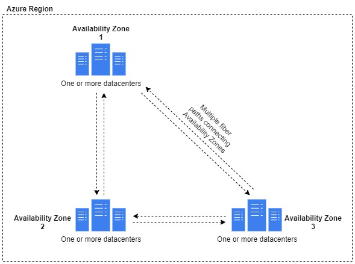
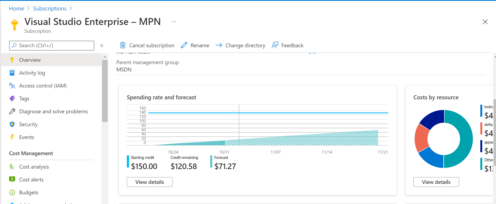
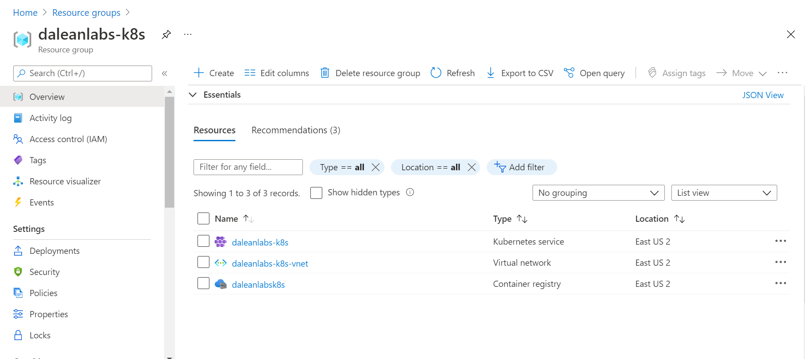
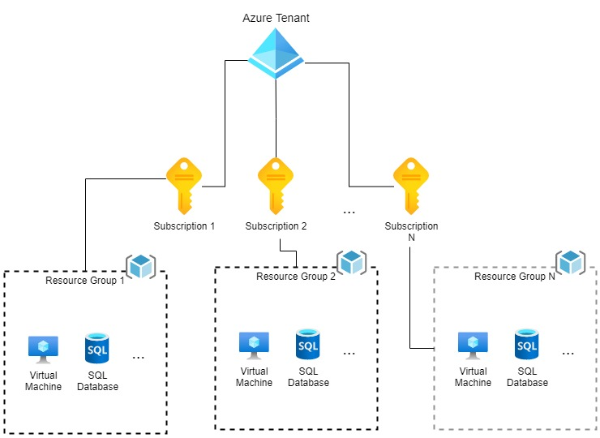

# 1. Azure Hierarchy

- [1. Azure Hierarchy](#1-azure-hierarchy)
  - [1.1. What is an Azure Region?](#11-what-is-an-azure-region)
  - [1.2. What is an Azure Availability Zone?](#12-what-is-an-azure-availability-zone)
  - [1.3. What is an Azure Subscription?](#13-what-is-an-azure-subscription)
    - [1.3.1. Other details regarding Azure subscriptions](#131-other-details-regarding-azure-subscriptions)
  - [1.4. Azure Resource Groups](#14-azure-resource-groups)
  - [1.5. Azure Resources](#15-azure-resources)
  - [1.6. Next Steps](#16-next-steps)

## 1.1. What is an Azure Region?

Azure regions are a set of datacenters deployed within a latency-defined perimeter and connected through a dedicated regional low-latency network. To put simply, an Azure region is a group of datacenters that are working together; they are near enough to facilitate low latency network communication, but far apart enough to limit to blast radius of regional outages. Regions help to meet tax, compliance, legal, and availability needs for applications and other cloud solutions.

## 1.2. What is an Azure Availability Zone?

Azure Availability Zones (AZ for short) are physically separate datacenters within a region that can tolerate local failures such as hardware and software failures, floods, earthquakes, and fires. Microsoft ensure that tolerance to failure is achieved by making components redundant and logically isolating Azure services.

The diagram above shows a very simple representation of Azure Availability Zones.

An region is considered to be availability zone-enabled if it has at least three (3) separate availability zones. [Here are a list of regions with availability zones.](https://docs.microsoft.com/en-us/azure/availability-zones/az-overview#azure-regions-with-availability-zones)

## 1.3. What is an Azure Subscription?

An Azure subscription is your way of telling Microsoft how you are going to pay for the Azure resources you consume (Please do note that you can get a free Microsoft Azure subscription where credit is allocated to your subscription). There is usually a credit card attached to your Azure subscription, you can view invoices, and actual and predicted usage as it relates to the resources in your subscription.

The image above shows a snip of an Azure subscription showing the spending rate and forecast.

### 1.3.1. Other details regarding Azure subscriptions

- You can have multiple Azure subscriptions (for example, one for dev/testing and another for production)
- You must an active Azure subscription before you can create Azure resources (such as Virtual Networks, Virtual Machines, Web Apps, etc.)
- You can move subscriptions between Azure tenants (there are some grey areas here, especially when dealing with Cloud Solutions Providers, but generally speaking you can move subscriptions between Microsoft tenants).

## 1.4. Azure Resource Groups

Azure Azure Resource Group is a logical container for grouping Azure resources with a similar lifecycle. This is not a hard rule, as you can generally put Azure resources in any resource group you like, but usually you see resources that are create together and that will be deleted together in the same resource group. Think of Azure Resource Groups like Active Directory Organizational Units (OUs), where you can put an arbitrary number and type of resources that make sense to you.

The above screen capture shows an Azure resource group with a few Azure resources inside

## 1.5. Azure Resources

Azure resources are the actual products and services that you provision to solve a problem. These can be Azure Virtual Machines used to run web applications, or fully managed services such as SQL Databases used to store user data for a customer facing application. The idea is that, you provision the Azure resources that will help you to best solve the problem or the goal you have in mind. [Azure has over 200 products and services, and they can be found here](https://azure.microsoft.com/en-us/services/).

The relationship between Azure Tenants, Subscriptions, Resource Groups, and Resources is shown below:

## 1.6. Next Steps

[Now that you have completed this section, please move on to the exercises to learn more and gain more knowledge around Azure regions, Azure AZs, Azure subscriptions, Azure resource groups, and Azure resources](../azure-heirarchy/practice/README.md)